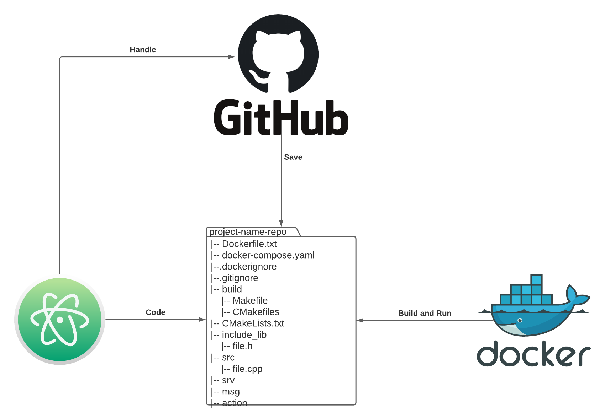

# Hi there 👋
🌱 I’m currently learning a Computer Engineering student at the @University of Florence.

## About me
 My goal is to become a **robot oriented software developer**. The main focuses of my studies are: 
- *robotics systems and automation theory* 🤖⚙️
- *machine learning* 🧠♟️
- *software engineering for control systems* 💻⚙️
- *embedded systems and code coverage* 🚀✈️

## Repos I'm proud of
- [Feedback linearization controller for AUV](https://github.com/AngeloDamante/AUV_feedback_linearization_controller): Develop of feedback linearization controller for AUV in python.
- [Control system for Furuta pendulum](https://github.com/AngeloDamante/Furuta_pendulum): Develop of control system for Furuta pendulum model in simulink.

## My workflow

