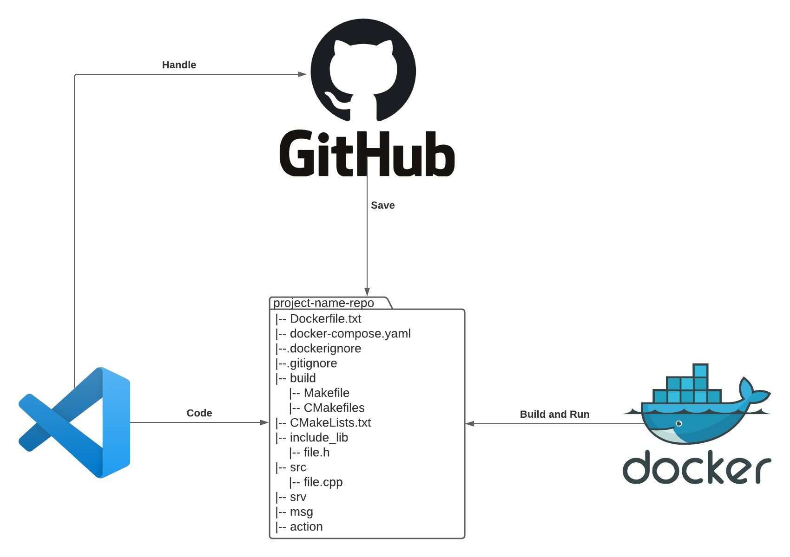

# Hi there 👋
🌱 I’m currently learning a Computer Engineering student at the @University of Florence.

## About me
 My goal is to become a **robot-oriented software developer**. The main focuses of my studies are: 
- *robotics systems and automation theory* 🤖⚙️
- *machine learning* 🧠♟️
- *software engineering for control systems* 💻⚙️
- *embedded systems and code coverage* 🚀✈️

 My main tools are **ROS**, **Python**, **C++** and **QT**.

## Repos I'm proud of
- [Feedback linearization controller for AUV](https://github.com/AngeloDamante/AUV_feedback_linearization_controller) `#Python, #ROS`
- [Control system for Furuta pendulum](https://github.com/AngeloDamante/Furuta_pendulum) `#Matlab, #Simulink, #Stateflow`
- [Embedded Software for Resilience Rover](https://github.com/AngeloDamante/rover-Raspberry-VxWorks) `#C++, #RT, #Raspberry, #VxWorks`
- [Tinkerkit Braccio 5 DOF control with Simulink](https://github.com/AngeloDamante/arm-manipulator-5dof) `#Simulink, #Stateflow, #Arduino`
- [Blob Detector for virus particles with segmentation techniques](https://github.com/AngeloDamante/particle-segmentation-detector) `#PyTorch, #NeuralNetwork, #DeepLearning`
- [Vision Control System for Differential Drive](https://github.com/AngeloDamante/trylo_core) `#Ros2, #Kalman, #Aruco

## My workflow

 

